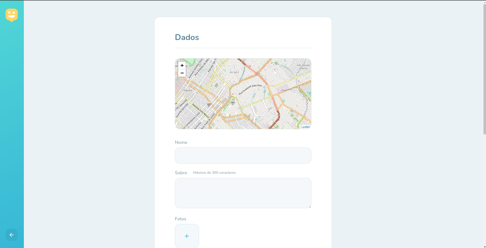

# 

Web application to view orphanage's address, days, and hours that are open to visit.

## Technologies used

> Typescript  
> ReactJs  
> Css

## Páginas

#### Landing

#### Home

#### Add orphanage

## Run application

> run `npm run start` or `yarn start` to run application in development mode  
> run `npm run build` or `yarn build` to build to production application

## License

This project is under license [MIT](LICENSE)
